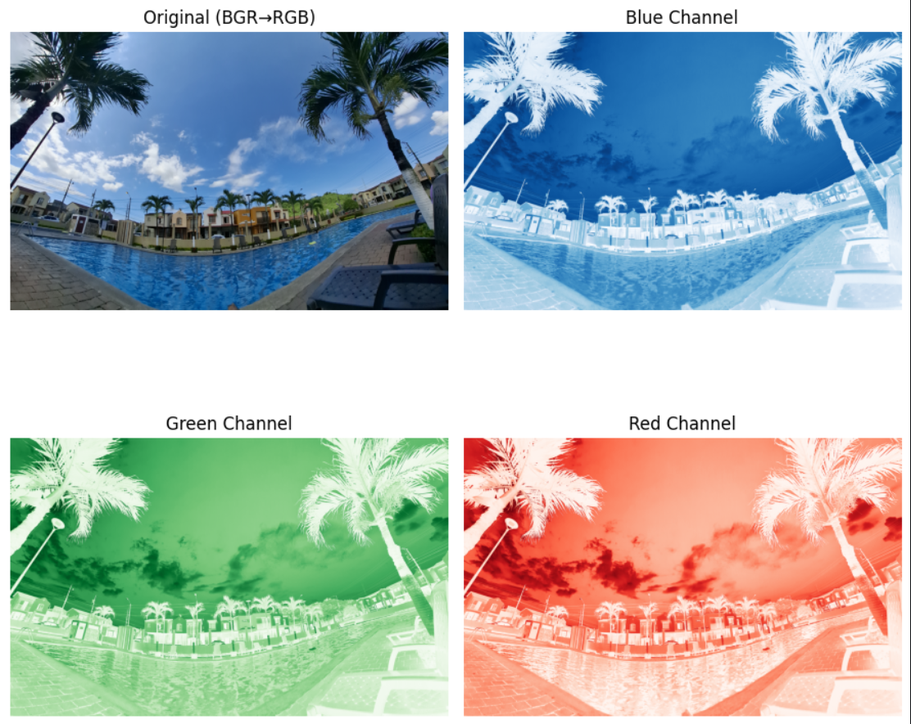

# 📸 Computer Vision – Lecture 1: Digital Image Fundamentals


This project demonstrates the **mathematical and computational representation of digital images** using **OpenCV** and **NumPy**.

It is part of a **Computer Vision learning series**, designed to help students understand how images are represented and manipulated programmatically in Python.

---

# 🚀 Quick Start
``` 
Clone the repository and run the notebook:
    git clone https://github.com/jeremi-silva/computer-vision-lecture-01.git
    cd computer-vision-lecture-01
    pip install -r requirements.txt
    jupyter notebook

Then open:
    notebook/lecture_1.ipynb

and execute the cells using:
    Shift + Enter
``` 
---

# 📚 Topics Covered

This lecture introduces the **fundamental concepts behind digital images in Computer Vision**.

Topics explored in this project include:

1. **Reading an image**  
   Loading images from disk using OpenCV.

2. **Checking image attributes**  
   Understanding image properties such as:
   - Dimensions
   - Number of channels
   - Data type

3. **Format and color space analysis**  
   Understanding how OpenCV stores images in **BGR format** and converting them to other formats such as **RGB and grayscale**.

4. **Matrix representation of images**  
   Learning how images are represented as **NumPy multidimensional arrays**.

5. **Channel splitting and merging**  
   Separating and manipulating individual **Red, Green, and Blue channels**.

6. **Displaying images with Matplotlib**  
   Visualizing images correctly inside Jupyter notebooks.

7. **Saving processed images**  
   Exporting processed images back to disk.

---

# 🧠 What You Will Learn

After completing this lecture you will understand:

- How digital images are represented as **numerical matrices**
- The meaning of **height, width, and channels**
- How OpenCV loads and processes images
- How to manipulate image data using **NumPy**
- How to split and analyze **RGB color channels**
- How to correctly display images in Python using **Matplotlib**

These concepts are essential before moving on to more advanced topics in **Computer Vision**.

---

# 🖼 Example Result

The following figure shows an example of **channel splitting**, where the original image is compared with its individual **Red, Green, and Blue channels**.



This visualization helps illustrate how each color channel contributes to the final image.

---

# ⚙️ Installation

## 1. Install Python

Make sure you have **Python 3.8 or higher** installed.
``` 
You can download it here:

https://www.python.org/downloads/

Verify installation:
    python --version
``` 
---

## 2. Install dependencies

This project includes a `requirements.txt` file containing all necessary libraries.
``` 
Install them with:
    pip install -r requirements.txt
``` 
The main libraries used in this project are:

- **OpenCV** – Computer vision processing
- **NumPy** – Numerical array operations
- **Matplotlib** – Visualization
- **Jupyter Notebook** – Interactive environment

---

# 🚀 Running the Project

## Step 1 — Start Jupyter Notebook
``` 
From the root directory of the project run:
    jupyter notebook    
``` 
This will open the **Jupyter interface in your browser**.

---

## Step 2 — Open the notebook
``` 
Navigate to the folder:
    notebook/

Then open:
    lecture_1.ipynb
``` 
---

## Step 3 — Run the notebook
``` 
Execute each code cell sequentially using:
    Shift + Enter

This will run the code and display the results step by step.
``` 
---
``` 
# 📂 Project Structure
computer-vision-lecture-01/
│
├── notebook/ # Jupyter notebooks for the lecture
│ └── lecture_1.ipynb
│
├── images/ # Input images used in the examples
│
├── outputs/ # Generated results and processed images
│ └── channel_split_example.png
│
├── requirements.txt # Python dependencies
│
└── README.md # Project documentation
``` 
---

# 🛠 Technologies Used

This project uses the following tools and libraries:

- **Python** – Main programming language
- **OpenCV** – Computer vision operations
- **NumPy** – Matrix and numerical operations
- **Matplotlib** – Image visualization
- **Jupyter Notebook** – Interactive development environment

---

# 🎓 Educational Purpose

This repository is part of a **Computer Vision learning series** aimed at helping students understand the **fundamental structure of digital images** before moving to more advanced topics such as:

- Image filtering
- Edge detection
- Feature extraction
- Object recognition

---

# 🔮 Future Lectures

Upcoming lectures in this series may include:

- Image filtering and smoothing
- Edge detection (Sobel, Canny)
- Histogram analysis
- Feature detection
- Object detection fundamentals

---

# 🤝 Contributing

Contributions are welcome!

If you have suggestions to improve this project, feel free to:

1. Fork the repository
2. Create a new branch
3. Submit a pull request

Any improvements related to explanations, notebooks, or examples are greatly appreciated.

---

# 🎥 Presentation Slides

You can find the slides used for this lecture here:

https://drive.google.com/file/d/1ymAANfUbr8HbG8RX8aGn5GSyM26I-0VW/view?usp=drivesdk---

# 📩 Contact

This lecture was developed as part of the **AIROS – ESPOL Robotics & AI Club**.

**Jeremi Silva**  
GitHub: https://github.com/jeremi-silva  

**Juan Francisco Sanchez**  
GitHub: https://github.com/juanfranciscosm

---

AIROS – ESPOL


